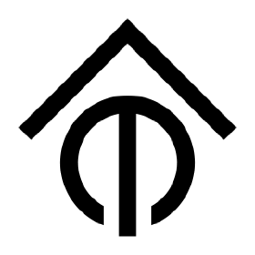

# ioBroker.tasmota

**Tests:** 

---

## 🌍 Overview

This adapter integrates <strong>Tasmota</strong> smart home devices into ioBroker via <strong>MQTT</strong>.

It supports two modes of operation: as a built-in **MQTT broker** (server mode) so Tasmota devices connect directly, or as an **MQTT client** connecting to an existing broker such as Mosquitto.

All Tasmota devices are discovered automatically — no manual configuration per device required. As soon as a device publishes its first message, the adapter creates the corresponding ioBroker objects and states dynamically.

---

## 📖 Documentation

[🇺🇸 Documentation](docs/en/README.md)

[🇩🇪 Dokumentation](docs/de/README.md)

---

## 🚀 Quick Start

1. Install adapter in ioBroker
2. Open instance configuration
3. Choose mode and enter connection details:

| Setting              | Description                                    |
| -------------------- | ---------------------------------------------- |
| Mode                 | `server` (built-in broker) or `client`         |
| Port                 | MQTT port (default: **1883**)                  |
| Broker Host          | Hostname/IP of external broker (client mode)   |
| Topic Prefix         | One or more Tasmota topic prefixes, comma-separated (default: `tasmota`) |
| Topic Structure      | `device-first` or `prefix-first`               |
| Username / Password  | Optional MQTT authentication                   |
| TLS                  | Enable for encrypted connections               |

4. Save & start adapter
5. Flash Tasmota firmware on your device and configure the MQTT server to point to ioBroker

---

## 📌 Notes

- Any device running Tasmota firmware is automatically supported
- States are created on-the-fly when the first MQTT message arrives
- Both `device-first` (`device/tele/STATE`) and `prefix-first` (`tele/device/STATE`) topic formats are supported
- Multiple MQTT topic prefixes can be configured (comma-separated), e.g. `tasmota,home`
- The adapter can run as a standalone MQTT broker (no external broker needed)

---

## Changelog

<!--
	Placeholder for the next version (at the beginning of the line):
	### **WORK IN PROGRESS**
-->

### 0.0.3 (2026-03-24)

- (patricknitsch) Add support for multiple comma-separated topic prefixes
- (patricknitsch) Add separate English and German documentation in docs/
- (patricknitsch) Update README with documentation links

### 0.0.2 (2026-03-24)

- (patricknitsch) Update README with device documentation
- (patricknitsch) Add admin/tab.html device overview panel

### 0.0.1 (2026-03-24)

- (patricknitsch) initial release

---

## License

MIT License

Copyright (c) 2026 patricknitsch <patricknitsch@web.de>

Permission is hereby granted, free of charge, to any person obtaining a copy
of this software and associated documentation files (the "Software"), to deal
in the Software without restriction, including without limitation the rights
to use, copy, modify, merge, publish, distribute, sublicense, and/or sell
copies of the Software, and to permit persons to whom the Software is
furnished to do so, subject to the following conditions:

The above copyright notice and this permission notice shall be included in all
copies or substantial portions of the Software.

THE SOFTWARE IS PROVIDED "AS IS", WITHOUT WARRANTY OF ANY KIND, EXPRESS OR
IMPLIED, INCLUDING BUT NOT LIMITED TO THE WARRANTIES OF MERCHANTABILITY,
FITNESS FOR A PARTICULAR PURPOSE AND NONINFRINGEMENT. IN NO EVENT SHALL THE
AUTHORS OR COPYRIGHT HOLDERS BE LIABLE FOR ANY CLAIM, DAMAGES OR OTHER
LIABILITY, WHETHER IN AN ACTION OF CONTRACT, TORT OR OTHERWISE, ARISING FROM,
OUT OF OR IN CONNECTION WITH THE SOFTWARE OR THE USE OR OTHER DEALINGS IN THE
SOFTWARE.
