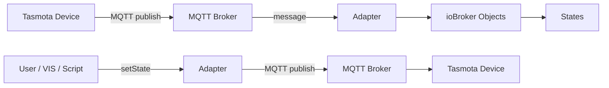
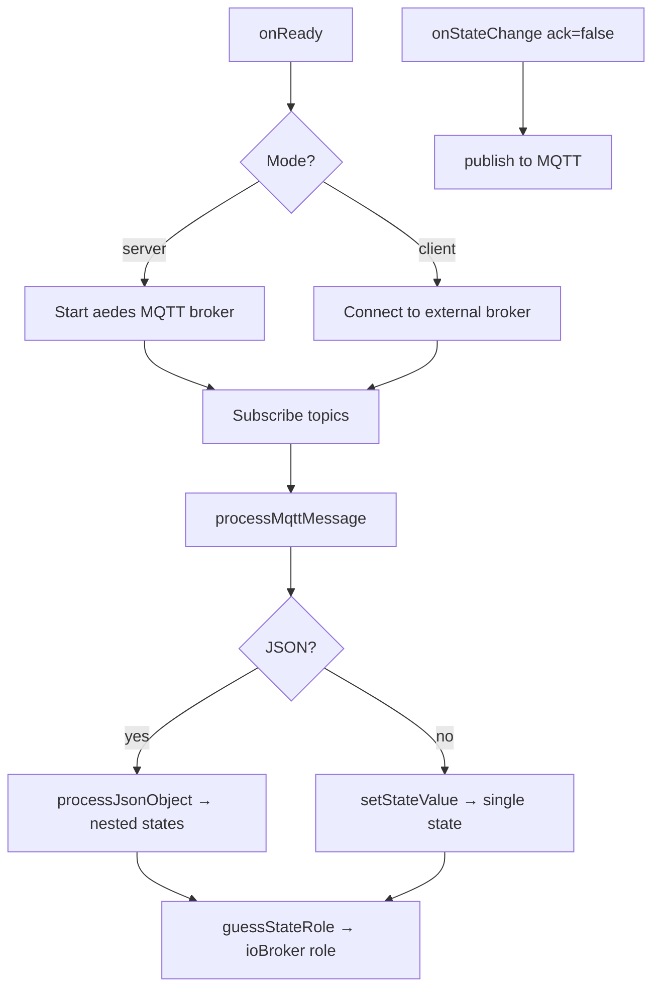

# ioBroker.tasmota

**Tests:** 

---

##

## 🌍 Overview

This adapter integrates <strong>Tasmota</strong> smart home devices into ioBroker via <strong>MQTT</strong>.

It supports two modes of operation: as a built-in **MQTT broker** (server mode) so Tasmota devices connect directly, or as an **MQTT client** connecting to an existing broker such as Mosquitto.

All Tasmota devices are discovered automatically — no manual configuration per device required. As soon as a device publishes its first message, the adapter creates the corresponding ioBroker objects and states dynamically.

##

## 🚀 How to Start

1. Install adapter in ioBroker
2. Open instance configuration
3. Choose mode and enter connection details:

| Setting              | Description                                    |
| -------------------- | ---------------------------------------------- |
| Mode                 | `server` (built-in broker) or `client`         |
| Port                 | MQTT port (default: **1883**)                  |
| Broker Host          | Hostname/IP of external broker (client mode)   |
| Topic Prefix         | Tasmota topic prefix (default: `tasmota`)      |
| Topic Structure      | `device-first` or `prefix-first`               |
| Username / Password  | Optional MQTT authentication                   |
| TLS                  | Enable for encrypted connections               |

4. Save & start adapter
5. Flash Tasmota firmware on your device and configure the MQTT server to point to ioBroker

##

## 🖥️ Device Overview Tab

The adapter includes a built-in **Device Overview** tab in ioBroker Admin.
It displays all discovered Tasmota devices and their live states in a responsive card layout.

### Features of the tab

| Feature              | Description                                                    |
| -------------------- | -------------------------------------------------------------- |
| Device cards         | One card per discovered Tasmota device                         |
| Online / Offline     | Live connectivity badge based on LWT / STATUS messages         |
| Power control        | ON / OFF toggle buttons for each relay channel                 |
| Sensor display       | Temperature, humidity, pressure and other sensor readings      |
| Energy monitoring    | Voltage, current, power and energy consumption                 |
| WiFi info            | RSSI / Signal strength                                         |
| Device info          | Uptime, IP, hostname                                           |
| Search               | Filter devices by name                                         |
| Live updates         | Real-time state changes via ioBroker socket subscription       |
| Dark mode            | Automatically follows ioBroker Admin theme                     |
| i18n                 | German and English (auto-detected)                             |
| Configuration button | Opens the adapter instance configuration in one click          |

##

## 📋 Supported Device Types & States

The adapter **auto-discovers** any device running Tasmota firmware. The states created in the ioBroker object tree depend on the sensors and modules configured in Tasmota. Below are the most common device types and their states.

---

### 💡 Power Switch (single relay, e.g. Sonoff Basic / S20)

| State path            | Description               | R / W |
| --------------------- | ------------------------- | ----- |
| `stat.POWER`          | Current relay state       | R     |
| `cmnd.POWER`          | Set relay (ON / OFF)      | R/W   |
| `tele.STATE.POWER`    | Relay state in STATE msg  | R     |

---

### 🔀 Multi-Channel Switch (e.g. Sonoff 4CH, Sonoff Dual)

| State path             | Description                  | R / W |
| ---------------------- | ---------------------------- | ----- |
| `stat.POWER1`          | Channel 1 relay state        | R     |
| `stat.POWER2`          | Channel 2 relay state        | R     |
| `stat.POWER3`          | Channel 3 relay state        | R     |
| `stat.POWER4`          | Channel 4 relay state        | R     |
| `cmnd.POWER1`          | Set channel 1 (ON / OFF)     | R/W   |
| `cmnd.POWER2`          | Set channel 2 (ON / OFF)     | R/W   |
| `cmnd.POWER3`          | Set channel 3 (ON / OFF)     | R/W   |
| `cmnd.POWER4`          | Set channel 4 (ON / OFF)     | R/W   |

---

### 🌡️ Temperature / Humidity Sensor (e.g. Tasmota + DHT22, BME280, DS18B20)

| State path                          | Description            | R / W |
| ----------------------------------- | ---------------------- | ----- |
| `tele.SENSOR.Temperature`           | Temperature (°C)       | R     |
| `tele.SENSOR.Humidity`              | Relative humidity (%)  | R     |
| `tele.SENSOR.DewPoint`              | Dew point (°C)         | R     |
| `tele.SENSOR.Pressure`              | Atmospheric pressure (hPa) | R |
| `tele.STATE.DS18B20.Temperature`    | DS18B20 temperature    | R     |

---

### ⚡ Energy Monitor (e.g. Sonoff Pow, Sonoff Pow R2)

| State path                    | Description                  | R / W |
| ----------------------------- | ---------------------------- | ----- |
| `tele.ENERGY.Voltage`         | Mains voltage (V)            | R     |
| `tele.ENERGY.Current`         | Current draw (A)             | R     |
| `tele.ENERGY.Power`           | Active power (W)             | R     |
| `tele.ENERGY.ApparentPower`   | Apparent power (VA)          | R     |
| `tele.ENERGY.ReactivePower`   | Reactive power (var)         | R     |
| `tele.ENERGY.Factor`          | Power factor                 | R     |
| `tele.ENERGY.Today`           | Energy today (kWh)           | R     |
| `tele.ENERGY.Yesterday`       | Energy yesterday (kWh)       | R     |
| `tele.ENERGY.Total`           | Total energy (kWh)           | R     |

---

### 🌿 Air Quality / Environmental Sensor (e.g. Tasmota + MHZ19, SGP30, SCD30)

| State path                    | Description              | R / W |
| ----------------------------- | ------------------------ | ----- |
| `tele.SENSOR.CarbonDioxide`   | CO₂ concentration (ppm)  | R     |
| `tele.SENSOR.TVOC`            | Total VOC (ppb)          | R     |
| `tele.SENSOR.Illuminance`     | Illuminance (lux)        | R     |

---

### 📶 Device Status (all Tasmota devices)

| State path                    | Description                         | R / W |
| ----------------------------- | ----------------------------------- | ----- |
| `tele.STATE.Uptime`           | Device uptime                       | R     |
| `tele.STATE.Wifi.RSSI`        | WiFi signal strength (dBm)          | R     |
| `tele.STATE.Wifi.Signal`      | WiFi signal quality (%)             | R     |
| `tele.LWT`                    | Last-Will-Testament (Online/Offline) | R    |
| `stat.STATUS.Hostname`        | Device hostname                     | R     |
| `stat.STATUS.IPAddress`       | Device IP address                   | R     |

##

## Compact Architecture Overview

### Architecture Badges

### Program Flow

### Internal Flow

##

## 📌 Notes

- Any device running Tasmota firmware is automatically supported
- States are created on-the-fly when the first MQTT message arrives
- Both `device-first` (`device/tele/STATE`) and `prefix-first` (`tele/device/STATE`) topic formats are supported
- The adapter can run as a standalone MQTT broker (no external broker needed)

##

## Changelog

<!--
	Placeholder for the next version (at the beginning of the line):
	### **WORK IN PROGRESS**
-->

### 0.0.2 (2026-03-24)

- (patricknitsch) Update README with device documentation
- (patricknitsch) Add admin/tab.html device overview panel

### 0.0.1 (2026-03-24)

- (patricknitsch) initial release

##

## License

MIT License

Copyright (c) 2026 patricknitsch <patricknitsch@web.de>

Permission is hereby granted, free of charge, to any person obtaining a copy
of this software and associated documentation files (the "Software"), to deal
in the Software without restriction, including without limitation the rights
to use, copy, modify, merge, publish, distribute, sublicense, and/or sell
copies of the Software, and to permit persons to whom the Software is
furnished to do so, subject to the following conditions:

The above copyright notice and this permission notice shall be included in all
copies or substantial portions of the Software.

THE SOFTWARE IS PROVIDED "AS IS", WITHOUT WARRANTY OF ANY KIND, EXPRESS OR
IMPLIED, INCLUDING BUT NOT LIMITED TO THE WARRANTIES OF MERCHANTABILITY,
FITNESS FOR A PARTICULAR PURPOSE AND NONINFRINGEMENT. IN NO EVENT SHALL THE
AUTHORS OR COPYRIGHT HOLDERS BE LIABLE FOR ANY CLAIM, DAMAGES OR OTHER
LIABILITY, WHETHER IN AN ACTION OF CONTRACT, TORT OR OTHERWISE, ARISING FROM,
OUT OF OR IN CONNECTION WITH THE SOFTWARE OR THE USE OR OTHER DEALINGS IN THE
SOFTWARE.
