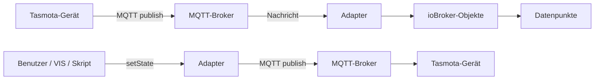
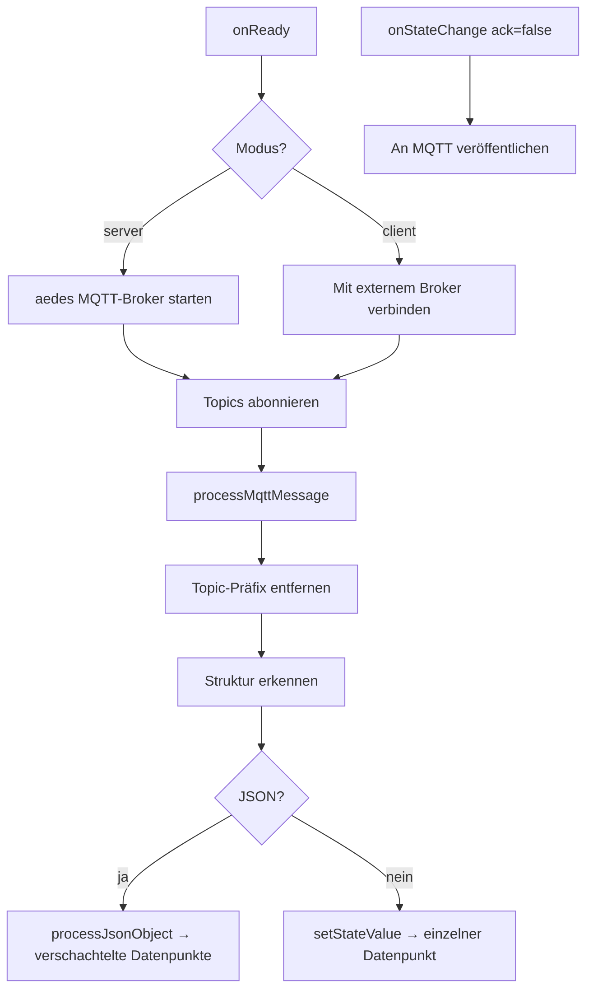

# ioBroker Tasmota Adapter — Dokumentation

## Inhaltsverzeichnis

1. [Überblick](#1-überblick)
2. [Schnellstart](#2-schnellstart)
3. [Verbindungsmodi](#3-verbindungsmodi)
4. [Konfigurationsreferenz](#4-konfigurationsreferenz)
5. [Topic-Einstellungen](#5-topic-einstellungen)
6. [Device Manager](#6-device-manager)
7. [Objektbaum-Struktur](#7-objektbaum-struktur)
8. [Unterstützte Datenpunkte](#8-unterstützte-datenpunkte)
9. [Architektur](#9-architektur)

---

## 1. Überblick

Der **ioBroker Tasmota Adapter** integriert [Tasmota](https://tasmota.github.io/docs/) Smart-Home-Geräte über **MQTT** in ioBroker.

Alle Tasmota-Geräte werden **automatisch erkannt** — eine manuelle Konfiguration pro Gerät ist nicht erforderlich. Sobald ein Gerät seine erste MQTT-Nachricht veröffentlicht, erstellt der Adapter die entsprechenden ioBroker-Objekte und Datenpunkte dynamisch.

### Hauptmerkmale

- **Zwei Verbindungsmodi**: Integrierter MQTT-Broker (Servermodus) oder externer Broker als Client (Clientmodus)
- **Strukturierter Objektbaum**: Alle Daten werden in Standardkanäle klassifiziert (`status`, `info`, `energy`, `sensors`, `controls`) mit korrekten Typen, Rollen und Einheiten
- **Auto-Discovery**: Neue Geräte werden automatisch erkannt; sofort nach der Erkennung wird eine Status-0-Anfrage gesendet, um alle Info-Kanäle zu befüllen
- **Device Manager Integration**: Geräte erscheinen im ioBroker-Admin Device Manager — kein separater Tab erforderlich
- **Typisierte Datenpunkte**: Feldtypen, ioBroker-Rollen und Einheiten sind für alle bekannten Tasmota-Werte vordefiniert, angelehnt an den ioBroker.sonoff-Adapter
- **Mehrere Topic-Präfixe**: Es können mehrere MQTT-Topic-Präfixe gleichzeitig überwacht werden
- **Flexible Topic-Struktur**: Unterstützt `device-first`- und `prefix-first`-Tasmota-FullTopic-Formate
- **Schreibbare Steuerungen**: Relais (POWER*), Dimmer, Farbe und Farbtemperatur sind als schreibbare Datenpunkte modelliert
- **Mehrsprachig**: Oberfläche in 12 Sprachen verfügbar

---

## 2. Schnellstart

1. Adapter im ioBroker-Admin-Katalog installieren.
2. Instanzkonfiguration öffnen.
3. **Verbindungsmodus** wählen (`Client` oder `Server`) und die erforderlichen Verbindungsdaten eingeben.
4. Den **Topic-Präfix** passend zu den Tasmota-Geräten einstellen (Standard: `tasmota`).
5. Die **Topic-Struktur** passend zur Tasmota-FullTopic-Einstellung wählen.
6. Speichern und Adapter starten.
7. Tasmota-Firmware auf das Gerät flashen und MQTT so konfigurieren, dass es auf ioBroker zeigt.

Der Adapter erstellt automatisch ioBroker-Objekte für jedes Gerät, das er auf dem Broker sieht.

---

## 3. Verbindungsmodi

### Servermodus (integrierter Broker)

Der Adapter startet einen eigenen MQTT-Broker mit der [aedes](https://github.com/moscajs/aedes)-Bibliothek. Tasmota-Geräte verbinden sich direkt mit ioBroker — kein externer Broker erforderlich.

| Einstellung | Beschreibung | Standard |
|-------------|--------------|---------|
| Port | TCP-Port, auf dem der Broker lauscht | `1883` |
| Bind-Adresse | Netzwerkschnittstelle | `0.0.0.0` (alle Schnittstellen) |
| TLS verwenden | MQTTS aktivieren (verschlüsselt) | aus |
| Zertifikatsdatei | Pfad zum TLS-Zertifikat (PEM) | — |
| Schlüsseldatei | Pfad zum privaten TLS-Schlüssel (PEM) | — |
| Benutzername | Optionale MQTT-Authentifizierung | — |
| Passwort | Optionale MQTT-Authentifizierung | — |

### Clientmodus (externer Broker)

Der Adapter verbindet sich mit einem vorhandenen MQTT-Broker (z.B. Mosquitto, HiveMQ oder einem Cloud-Broker).

| Einstellung | Beschreibung | Standard |
|-------------|--------------|---------|
| Broker-Host | Hostname oder IP-Adresse des Brokers | `localhost` |
| Broker-Port | TCP-Port | `1883` |
| TLS verwenden | MQTTS aktivieren (verschlüsselt) | aus |
| Nicht autorisierte ablehnen | TLS-Zertifikatsprüfung erzwingen | ein |
| CA-Datei | Pfad zum CA-Zertifikat (PEM) | — |
| Zertifikatsdatei | Pfad zum Client-TLS-Zertifikat (PEM) | — |
| Schlüsseldatei | Pfad zum privaten Client-TLS-Schlüssel (PEM) | — |
| Benutzername | MQTT-Benutzername | — |
| Passwort | MQTT-Passwort | — |
| Client-ID | MQTT-Client-Bezeichner (automatisch generiert, wenn leer) | — |
| Keepalive | MQTT-Keepalive-Intervall (Sekunden) | `60` |
| Wiederverbindungsintervall | Wartezeit zwischen Verbindungsversuchen (ms) | `5000` |
| Timeout | Verbindungs-Timeout (Sekunden) | `300` |
| Sitzung bereinigen | Beim Verbinden eine neue Sitzung anfordern | ein |

---

## 4. Konfigurationsreferenz

Die Konfiguration ist in folgende Abschnitte unterteilt:

| Abschnitt | Sichtbar wenn |
|-----------|---------------|
| Verbindungsmodus | immer |
| Servereinstellungen | Modus = Server |
| Serverauthentifizierung | Modus = Server |
| Broker-Verbindung | Modus = Client |
| Broker-Authentifizierung | Modus = Client |
| Erweiterte Einstellungen | Modus = Client |
| Topic-Einstellungen | immer |

---

## 5. Topic-Einstellungen

Der Abschnitt **Topic-Einstellungen** legt fest, wie MQTT-Topics auf ioBroker-Datenpunkt-IDs abgebildet werden.

### Topic-Präfix

Ein oder mehrere MQTT-Topic-Präfixe, durch Komma getrennt.

| Beispiel | Beschreibung |
|----------|-------------|
| `tasmota` | Einzelner Präfix — abonniert `tasmota/#` |
| `tasmota,home` | Zwei Präfixe — abonniert `tasmota/#` und `home/#` |
| *(leer)* | Kein Präfix — abonniert alle Topics (`#`) |

Bei mehreren Präfixen abonniert der Adapter jeden Präfix separat. Eingehende Nachrichten werden gegen alle konfigurierten Präfixe geprüft und der passende Präfix wird vor der Verarbeitung entfernt.

Beim Veröffentlichen von Befehlen (z.B. über `cmnd`-Datenpunkte) wird der **erste** Präfix in der Liste verwendet.

### Topic-Struktur

Tasmota unterstützt zwei FullTopic-Layouts. Die passende Option muss zur Tasmota-Firmware-Einstellung (`SetOption19` / `FullTopic`) passen:

| Wert | Topic-Format | Beispiel |
|------|-------------|---------|
| `device-first` | `{Gerät}/{Präfix}/{Befehl}` | `office_light/tele/STATE` |
| `prefix-first` | `{Präfix}/{Gerät}/{Befehl}` | `tele/office_light/STATE` |

**Tasmota-Standard**: `%prefix%/%topic%/` → prefix-first  
**Häufige benutzerdefinierte Einstellung**: `%topic%/%prefix%/` → device-first

---

## 6. Device Manager

Ab Version 0.0.4 werden Geräte im **ioBroker-Admin → Device Manager** angezeigt anstatt in einem separaten Tab.

### Was angezeigt wird

Jedes Tasmota-Gerät erscheint als Gerätekarte im Device Manager mit:

- **Verbindungsstatus** (`status.online`) — abgeleitet aus dem LWT-Topic
- **WLAN-RSSI** (`status.rssi`) — Signalstärke in dBm
- **IP-Adresse und Hostname** — befüllt nach der Status-0-Antwort
- **Energiewerte** — Spannung, Leistung, Verbrauch (sofern das Gerät Energiemessung unterstützt)

### Geräte steuern

Schreibbare Datenpunkte (`controls.*`) können direkt aus dem ioBroker-Admin-Objektbaum oder aus Skripten heraus geändert werden. Wenn ein `controls.*`-Datenpunkt geschrieben wird (ack = false), veröffentlicht der Adapter das entsprechende `cmnd/…` MQTT-Topic an das Gerät.

### Rückwärtskompatibilität

Ältere `cmnd.*`-Datenpunkte (aus Adapterversionen vor 0.0.4) werden weiterhin für Schreiboperationen akzeptiert. Sowohl `controls.POWER` als auch `cmnd.POWER` lösen dieselbe MQTT-Veröffentlichung aus.

---

## 7. Objektbaum-Struktur

Jedes Tasmota-Gerät erhält folgendes strukturiertes Kanal-Layout:

```
tasmota.0
└── office_light                  (device)
    ├── status                    (channel — immer erstellt)
    │   ├── online                (boolean, indicator.connected)
    │   ├── rssi                  (number, dBm, value.rssi)
    │   ├── signal                (number, %, value)
    │   ├── ssid                  (string, info.ssid)
    │   ├── linkCount             (number, value)
    │   └── heap                  (number, kB, value)
    ├── info                      (channel — immer erstellt)
    │   ├── hostname              (string, info.name)
    │   ├── ip                    (string, info.ip)
    │   ├── mac                   (string, info.mac)
    │   ├── version               (string, info.firmware)
    │   ├── hardware              (string, info.hardware)
    │   ├── uptime                (string, info.uptime)
    │   └── friendlyName          (string, info.name)
    ├── controls                  (channel — immer erstellt)
    │   ├── POWER                 (boolean, switch.power, schreibbar)
    │   ├── POWER1 … POWER8       (boolean, switch.power, schreibbar)
    │   ├── Dimmer                (number, %, level.dimmer, schreibbar)
    │   ├── Color                 (string, schreibbar)
    │   └── CT                    (number, schreibbar)
    ├── energy                    (channel — bei Energiedaten erstellt)
    │   ├── voltage               (number, V, value.voltage)
    │   ├── current               (number, A, value.current)
    │   ├── power                 (number, W, value.power)
    │   ├── today                 (number, kWh, value.power.consumption)
    │   ├── yesterday             (number, kWh, value.power.consumption)
    │   └── total                 (number, kWh, value.power.consumption)
    └── sensors                   (channel — bei Sensordaten erstellt)
        ├── DHT22_Temperature     (number, °C, value.temperature)
        ├── DHT22_Humidity        (number, %, value.humidity)
        └── …                     (weitere Sensorfelder)
```

Unbekannte MQTT-Nachrichten, die keinem bekannten Muster entsprechen, werden im Kanal `raw` als String-Fallback gespeichert, damit keine Daten verloren gehen.

---

## 8. Unterstützte Datenpunkte

### Steuerungen (schreibbar)

| Datenpunkt | MQTT-Topic (wird gesendet) | Typ | Beschreibung |
|-----------|---------------------------|-----|-------------|
| `controls.POWER` | `cmnd/{device}/POWER` | boolean | Relais 1 |
| `controls.POWER1` … `POWER8` | `cmnd/{device}/POWER1` … | boolean | Mehrkanal-Relais |
| `controls.Dimmer` | `cmnd/{device}/Dimmer` | number (0–100 %) | Dimmer |
| `controls.Color` | `cmnd/{device}/Color` | string | Farbe |
| `controls.CT` | `cmnd/{device}/CT` | number | Farbtemperatur |

### Status (nur lesbar)

| Datenpunkt | Quell-MQTT-Nachricht | Einheit | Beschreibung |
|-----------|---------------------|---------|-------------|
| `status.online` | `tele/LWT` | — | Online / Offline |
| `status.rssi` | `tele/STATE Wifi.RSSI` | dBm | WLAN-Signalstärke |
| `status.signal` | `tele/STATE Wifi.Signal` | % | WLAN-Signalqualität |
| `status.ssid` | `tele/STATE Wifi.SSId` | — | WLAN-Netzwerkname |

### Info (nur lesbar, aus Status-0-Antwort)

| Datenpunkt | Quelle | Beschreibung |
|-----------|--------|-------------|
| `info.hostname` | `stat/STATUS5` | Gerätehostname |
| `info.ip` | `stat/STATUS5` | IP-Adresse |
| `info.mac` | `stat/STATUS5` | MAC-Adresse |
| `info.version` | `stat/STATUS2` | Firmware-Version |
| `info.hardware` | `stat/STATUS2` | Hardware-Typ (z.B. ESP8266EX) |
| `info.module` | `stat/STATUS` | Tasmota-Modulnummer |
| `info.friendlyName` | `stat/STATUS` | Freundlicher Name |
| `info.uptime` | `tele/STATE` | Gerät-Betriebszeit |

### Energie (nur lesbar)

| Datenpunkt | Einheit | Beschreibung |
|-----------|---------|-------------|
| `energy.voltage` | V | Netzspannung |
| `energy.current` | A | Stromstärke |
| `energy.power` | W | Wirkleistung |
| `energy.today` | kWh | Energie heute |
| `energy.yesterday` | kWh | Energie gestern |
| `energy.total` | kWh | Gesamtenergie |

### Sensoren (nur lesbar, Beispiele)

| Datenpunkt | Einheit | Beschreibung |
|-----------|---------|-------------|
| `sensors.{SensorName}_Temperature` | °C | Temperatur |
| `sensors.{SensorName}_Humidity` | % | Relative Luftfeuchtigkeit |
| `sensors.{SensorName}_Pressure` | hPa | Luftdruck |
| `sensors.{SensorName}_CarbonDioxide` | ppm | CO₂ |

---

## 9. Architektur

### Modulübersicht

| Modul | Aufgabe |
|-------|---------|
| `main.js` | Adapter-Lebenszyklus, MQTT-Verbindung, Nachrichtenrouting, Datenpunkt-Abonnements |
| `lib/mapper.js` | Bildet (prefix, command, payload) auf eine Liste von `{path, value, writable}`-Einträgen ab |
| `lib/datapoints.js` | Typisierte Datenpunkt-Definitionen (Typ, Rolle, Einheit, Lesen/Schreiben) für bekannte Tasmota-Felder |


## 7. Unterstützte Gerätetypen & Datenpunkte

Der Adapter erkennt automatisch jedes Gerät mit Tasmota-Firmware. Datenpunkte werden dynamisch aus MQTT-Nachrichten erstellt.

### 💡 Schaltsteckdose / Relais (Sonoff Basic, S20, …)

| Datenpunkt-Pfad | Beschreibung | R/W |
|-----------------|-------------|-----|
| `stat.POWER` | Aktueller Relaiszustand | R |
| `cmnd.POWER` | Relais setzen (ON / OFF) | R/W |
| `tele.STATE.POWER` | Relaiszustand in STATE-Nachricht | R |

### 🔀 Mehrkanal-Schalter (Sonoff 4CH, Dual, …)

| Datenpunkt-Pfad | Beschreibung | R/W |
|-----------------|-------------|-----|
| `stat.POWER1` … `stat.POWER4` | Relaiszustand Kanal 1–4 | R |
| `cmnd.POWER1` … `cmnd.POWER4` | Kanal 1–4 setzen (ON / OFF) | R/W |

### 🌡️ Temperatur-/Luftfeuchtigkeitssensor (DHT22, BME280, DS18B20, …)

| Datenpunkt-Pfad | Beschreibung | R/W |
|-----------------|-------------|-----|
| `tele.SENSOR.Temperature` | Temperatur (°C) | R |
| `tele.SENSOR.Humidity` | Relative Luftfeuchtigkeit (%) | R |
| `tele.SENSOR.DewPoint` | Taupunkt (°C) | R |
| `tele.SENSOR.Pressure` | Luftdruck (hPa) | R |
| `tele.STATE.DS18B20.Temperature` | DS18B20-Temperatur | R |

### ⚡ Energiemessgerät (Sonoff Pow, Pow R2, …)

| Datenpunkt-Pfad | Beschreibung | R/W |
|-----------------|-------------|-----|
| `tele.ENERGY.Voltage` | Netzspannung (V) | R |
| `tele.ENERGY.Current` | Stromaufnahme (A) | R |
| `tele.ENERGY.Power` | Wirkleistung (W) | R |
| `tele.ENERGY.ApparentPower` | Scheinleistung (VA) | R |
| `tele.ENERGY.ReactivePower` | Blindleistung (var) | R |
| `tele.ENERGY.Factor` | Leistungsfaktor | R |
| `tele.ENERGY.Today` | Energie heute (kWh) | R |
| `tele.ENERGY.Yesterday` | Energie gestern (kWh) | R |
| `tele.ENERGY.Total` | Gesamtenergie (kWh) | R |

### 🌿 Luftqualitäts-/Umgebungssensor (MHZ19, SGP30, SCD30, …)

| Datenpunkt-Pfad | Beschreibung | R/W |
|-----------------|-------------|-----|
| `tele.SENSOR.CarbonDioxide` | CO₂-Konzentration (ppm) | R |
| `tele.SENSOR.TVOC` | Gesamt-VOC (ppb) | R |
| `tele.SENSOR.Illuminance` | Beleuchtungsstärke (lux) | R |

### 📶 Gerätestatus (alle Tasmota-Geräte)

| Datenpunkt-Pfad | Beschreibung | R/W |
|-----------------|-------------|-----|
| `tele.STATE.Uptime` | Gerätebetriebszeit | R |
| `tele.STATE.Wifi.RSSI` | WLAN-Signalstärke (dBm) | R |
| `tele.STATE.Wifi.Signal` | WLAN-Signalqualität (%) | R |
| `tele.LWT` | Last Will Testament (Online / Offline) | R |
| `stat.STATUS.Hostname` | Gerätehostname | R |
| `stat.STATUS.IPAddress` | Geräte-IP-Adresse | R |

---

## 8. Architektur

### Programmfluss



### Interne Nachrichtenverarbeitung



### ioBroker-Objektbaum Beispiel

```
tasmota.0
└── office_light         (device)
    ├── tele             (channel)
    │   ├── STATE        (channel)
    │   │   ├── POWER    (state, boolean)
    │   │   └── Wifi     (channel)
    │   │       └── RSSI (state, number)
    │   └── ENERGY       (channel)
    │       ├── Power    (state, number)
    │       └── Total    (state, number)
    ├── stat             (channel)
    │   └── POWER        (state, boolean)
    └── cmnd             (channel)
        └── POWER        (state, boolean, schreibbar)
```
