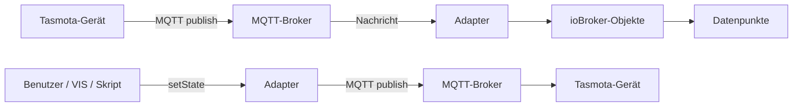
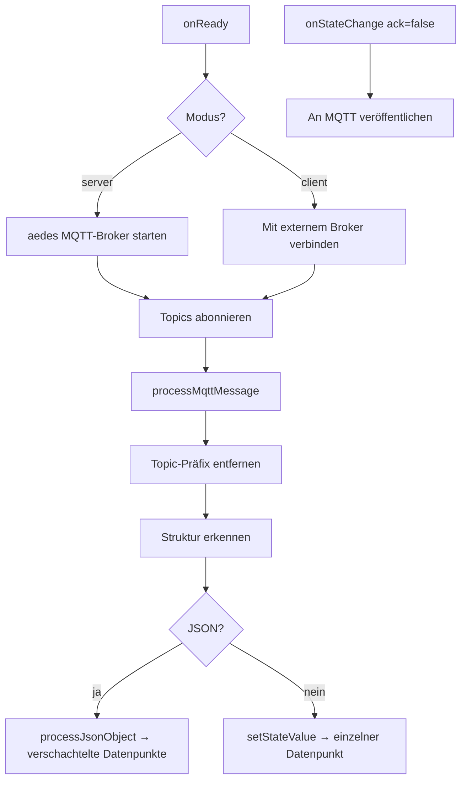

# ioBroker Tasmota Adapter — Dokumentation

## Inhaltsverzeichnis

1. [Überblick](#1-überblick)
2. [Schnellstart](#2-schnellstart)
3. [Verbindungsmodi](#3-verbindungsmodi)
4. [Konfigurationsreferenz](#4-konfigurationsreferenz)
5. [Topic-Einstellungen](#5-topic-einstellungen)
6. [Geräteübersicht-Tab](#6-geräteübersicht-tab)
7. [Unterstützte Gerätetypen & Datenpunkte](#7-unterstützte-gerätetypen--datenpunkte)
8. [Architektur](#8-architektur)

---

## 1. Überblick

Der **ioBroker Tasmota Adapter** integriert [Tasmota](https://tasmota.github.io/docs/) Smart-Home-Geräte über **MQTT** in ioBroker.

Alle Tasmota-Geräte werden **automatisch erkannt** — eine manuelle Konfiguration pro Gerät ist nicht erforderlich. Sobald ein Gerät seine erste MQTT-Nachricht veröffentlicht, erstellt der Adapter die entsprechenden ioBroker-Objekte und Datenpunkte dynamisch.

### Hauptmerkmale

- **Zwei Verbindungsmodi**: Integrierter MQTT-Broker (Servermodus) oder externer Broker als Client (Clientmodus)
- **Auto-Discovery**: Geräte und ihre Datenpunkte werden automatisch aus eingehenden MQTT-Nachrichten erstellt
- **Mehrere Topic-Präfixe**: Es können mehrere MQTT-Topic-Präfixe gleichzeitig überwacht werden
- **Flexible Topic-Struktur**: Unterstützt `device-first`- und `prefix-first`-Tasmota-FullTopic-Formate
- **Geräteübersicht-Tab**: Integriertes Admin-Panel mit Live-Zustandsaktualisierungen, EIN/AUS-Steuerung und Dark-Mode-Unterstützung
- **Mehrsprachig**: Oberfläche in 12 Sprachen verfügbar

---

## 2. Schnellstart

1. Adapter im ioBroker-Admin-Katalog installieren.
2. Instanzkonfiguration öffnen.
3. **Verbindungsmodus** wählen (`Client` oder `Server`) und die erforderlichen Verbindungsdaten eingeben.
4. Den **Topic-Präfix** passend zu den Tasmota-Geräten einstellen (Standard: `tasmota`).
5. Die **Topic-Struktur** passend zur Tasmota-FullTopic-Einstellung wählen.
6. Speichern und Adapter starten.
7. Tasmota-Firmware auf das Gerät flashen und MQTT so konfigurieren, dass es auf ioBroker zeigt.

Der Adapter erstellt automatisch ioBroker-Objekte für jedes Gerät, das er auf dem Broker sieht.

---

## 3. Verbindungsmodi

### Servermodus (integrierter Broker)

Der Adapter startet einen eigenen MQTT-Broker mit der [aedes](https://github.com/moscajs/aedes)-Bibliothek. Tasmota-Geräte verbinden sich direkt mit ioBroker — kein externer Broker erforderlich.

| Einstellung | Beschreibung | Standard |
|-------------|--------------|---------|
| Port | TCP-Port, auf dem der Broker lauscht | `1883` |
| Bind-Adresse | Netzwerkschnittstelle | `0.0.0.0` (alle Schnittstellen) |
| TLS verwenden | MQTTS aktivieren (verschlüsselt) | aus |
| Zertifikatsdatei | Pfad zum TLS-Zertifikat (PEM) | — |
| Schlüsseldatei | Pfad zum privaten TLS-Schlüssel (PEM) | — |
| Benutzername | Optionale MQTT-Authentifizierung | — |
| Passwort | Optionale MQTT-Authentifizierung | — |

### Clientmodus (externer Broker)

Der Adapter verbindet sich mit einem vorhandenen MQTT-Broker (z.B. Mosquitto, HiveMQ oder einem Cloud-Broker).

| Einstellung | Beschreibung | Standard |
|-------------|--------------|---------|
| Broker-Host | Hostname oder IP-Adresse des Brokers | `localhost` |
| Broker-Port | TCP-Port | `1883` |
| TLS verwenden | MQTTS aktivieren (verschlüsselt) | aus |
| Nicht autorisierte ablehnen | TLS-Zertifikatsprüfung erzwingen | ein |
| CA-Datei | Pfad zum CA-Zertifikat (PEM) | — |
| Zertifikatsdatei | Pfad zum Client-TLS-Zertifikat (PEM) | — |
| Schlüsseldatei | Pfad zum privaten Client-TLS-Schlüssel (PEM) | — |
| Benutzername | MQTT-Benutzername | — |
| Passwort | MQTT-Passwort | — |
| Client-ID | MQTT-Client-Bezeichner (automatisch generiert, wenn leer) | — |
| Keepalive | MQTT-Keepalive-Intervall (Sekunden) | `60` |
| Wiederverbindungsintervall | Wartezeit zwischen Verbindungsversuchen (ms) | `5000` |
| Timeout | Verbindungs-Timeout (Sekunden) | `300` |
| Sitzung bereinigen | Beim Verbinden eine neue Sitzung anfordern | ein |

---

## 4. Konfigurationsreferenz

Die Konfiguration ist in folgende Abschnitte unterteilt:

| Abschnitt | Sichtbar wenn |
|-----------|---------------|
| Verbindungsmodus | immer |
| Servereinstellungen | Modus = Server |
| Serverauthentifizierung | Modus = Server |
| Broker-Verbindung | Modus = Client |
| Broker-Authentifizierung | Modus = Client |
| Erweiterte Einstellungen | Modus = Client |
| Topic-Einstellungen | immer |

---

## 5. Topic-Einstellungen

Der Abschnitt **Topic-Einstellungen** legt fest, wie MQTT-Topics auf ioBroker-Datenpunkt-IDs abgebildet werden.

### Topic-Präfix

Ein oder mehrere MQTT-Topic-Präfixe, durch Komma getrennt.

| Beispiel | Beschreibung |
|----------|-------------|
| `tasmota` | Einzelner Präfix — abonniert `tasmota/#` |
| `tasmota,home` | Zwei Präfixe — abonniert `tasmota/#` und `home/#` |
| *(leer)* | Kein Präfix — abonniert alle Topics (`#`) |

Bei mehreren Präfixen abonniert der Adapter jeden Präfix separat. Eingehende Nachrichten werden gegen alle konfigurierten Präfixe geprüft und der passende Präfix wird vor der Verarbeitung entfernt.

Beim Veröffentlichen von Befehlen (z.B. über `cmnd`-Datenpunkte) wird der **erste** Präfix in der Liste verwendet.

### Topic-Struktur

Tasmota unterstützt zwei FullTopic-Layouts. Die passende Option muss zur Tasmota-Firmware-Einstellung (`SetOption19` / `FullTopic`) passen:

| Wert | Topic-Format | Beispiel |
|------|-------------|---------|
| `device-first` | `{Gerät}/{Präfix}/{Befehl}` | `office_light/tele/STATE` |
| `prefix-first` | `{Präfix}/{Gerät}/{Befehl}` | `tele/office_light/STATE` |

**Tasmota-Standard**: `%prefix%/%topic%/` → prefix-first  
**Häufige benutzerdefinierte Einstellung**: `%topic%/%prefix%/` → device-first

---

## 6. Geräteübersicht-Tab

Der Adapter fügt dem ioBroker-Admin-Interface einen **Geräteübersicht**-Tab hinzu.

### Zugriff auf den Tab

ioBroker-Admin öffnen und den Tab **Geräteübersicht** im Adapterbereich auswählen.

### Funktionen

| Funktion | Beschreibung |
|----------|-------------|
| Geräteauswahl | Dropdown zum Wechseln zwischen allen erkannten Geräten |
| Online-/Offline-Badge | Basierend auf LWT (Last Will Testament) oder STATUS-Nachricht |
| Befehle (cmnd) | Schreibbare Datenpunkte; EIN/AUS-Buttons für Relais |
| Status (stat) | Schreibgeschützte Datenpunkte vom Gerät |
| Live-Updates | Echtzeit-Datenpunktänderungen über ioBroker-Socket-Abonnement |
| Konfigurationsschaltfläche | Öffnet direkt die Instanzkonfiguration |
| Dark Mode | Folgt automatisch dem ioBroker-Admin-Theme |
| Mehrsprachig | Deutsch und Englisch (aus Admin-Sprache erkannt) |

### Leistungssteuerung

Um ein Relais umzuschalten, auf die Schaltfläche **EIN** oder **AUS** im Befehlsbereich klicken. Der Adapter veröffentlicht den Befehl an das entsprechende `cmnd`-MQTT-Topic.

---

## 7. Unterstützte Gerätetypen & Datenpunkte

Der Adapter erkennt automatisch jedes Gerät mit Tasmota-Firmware. Datenpunkte werden dynamisch aus MQTT-Nachrichten erstellt.

### 💡 Schaltsteckdose / Relais (Sonoff Basic, S20, …)

| Datenpunkt-Pfad | Beschreibung | R/W |
|-----------------|-------------|-----|
| `stat.POWER` | Aktueller Relaiszustand | R |
| `cmnd.POWER` | Relais setzen (ON / OFF) | R/W |
| `tele.STATE.POWER` | Relaiszustand in STATE-Nachricht | R |

### 🔀 Mehrkanal-Schalter (Sonoff 4CH, Dual, …)

| Datenpunkt-Pfad | Beschreibung | R/W |
|-----------------|-------------|-----|
| `stat.POWER1` … `stat.POWER4` | Relaiszustand Kanal 1–4 | R |
| `cmnd.POWER1` … `cmnd.POWER4` | Kanal 1–4 setzen (ON / OFF) | R/W |

### 🌡️ Temperatur-/Luftfeuchtigkeitssensor (DHT22, BME280, DS18B20, …)

| Datenpunkt-Pfad | Beschreibung | R/W |
|-----------------|-------------|-----|
| `tele.SENSOR.Temperature` | Temperatur (°C) | R |
| `tele.SENSOR.Humidity` | Relative Luftfeuchtigkeit (%) | R |
| `tele.SENSOR.DewPoint` | Taupunkt (°C) | R |
| `tele.SENSOR.Pressure` | Luftdruck (hPa) | R |
| `tele.STATE.DS18B20.Temperature` | DS18B20-Temperatur | R |

### ⚡ Energiemessgerät (Sonoff Pow, Pow R2, …)

| Datenpunkt-Pfad | Beschreibung | R/W |
|-----------------|-------------|-----|
| `tele.ENERGY.Voltage` | Netzspannung (V) | R |
| `tele.ENERGY.Current` | Stromaufnahme (A) | R |
| `tele.ENERGY.Power` | Wirkleistung (W) | R |
| `tele.ENERGY.ApparentPower` | Scheinleistung (VA) | R |
| `tele.ENERGY.ReactivePower` | Blindleistung (var) | R |
| `tele.ENERGY.Factor` | Leistungsfaktor | R |
| `tele.ENERGY.Today` | Energie heute (kWh) | R |
| `tele.ENERGY.Yesterday` | Energie gestern (kWh) | R |
| `tele.ENERGY.Total` | Gesamtenergie (kWh) | R |

### 🌿 Luftqualitäts-/Umgebungssensor (MHZ19, SGP30, SCD30, …)

| Datenpunkt-Pfad | Beschreibung | R/W |
|-----------------|-------------|-----|
| `tele.SENSOR.CarbonDioxide` | CO₂-Konzentration (ppm) | R |
| `tele.SENSOR.TVOC` | Gesamt-VOC (ppb) | R |
| `tele.SENSOR.Illuminance` | Beleuchtungsstärke (lux) | R |

### 📶 Gerätestatus (alle Tasmota-Geräte)

| Datenpunkt-Pfad | Beschreibung | R/W |
|-----------------|-------------|-----|
| `tele.STATE.Uptime` | Gerätebetriebszeit | R |
| `tele.STATE.Wifi.RSSI` | WLAN-Signalstärke (dBm) | R |
| `tele.STATE.Wifi.Signal` | WLAN-Signalqualität (%) | R |
| `tele.LWT` | Last Will Testament (Online / Offline) | R |
| `stat.STATUS.Hostname` | Gerätehostname | R |
| `stat.STATUS.IPAddress` | Geräte-IP-Adresse | R |

---

## 8. Architektur

### Programmfluss



### Interne Nachrichtenverarbeitung



### ioBroker-Objektbaum Beispiel

```
tasmota.0
└── office_light         (device)
    ├── tele             (channel)
    │   ├── STATE        (channel)
    │   │   ├── POWER    (state, boolean)
    │   │   └── Wifi     (channel)
    │   │       └── RSSI (state, number)
    │   └── ENERGY       (channel)
    │       ├── Power    (state, number)
    │       └── Total    (state, number)
    ├── stat             (channel)
    │   └── POWER        (state, boolean)
    └── cmnd             (channel)
        └── POWER        (state, boolean, schreibbar)
```
