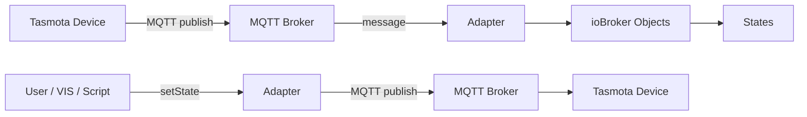
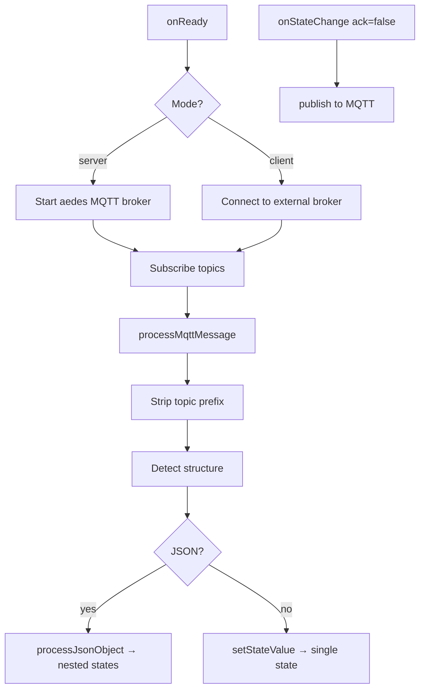

# ioBroker Tasmota Adapter — Documentation

## Table of Contents

1. [Overview](#1-overview)
2. [Quick Start](#2-quick-start)
3. [Connection Modes](#3-connection-modes)
4. [Configuration Reference](#4-configuration-reference)
5. [Topic Settings](#5-topic-settings)
6. [Device Overview Tab](#6-device-overview-tab)
7. [Supported Device Types & States](#7-supported-device-types--states)
8. [Architecture](#8-architecture)

---

## 1. Overview

The **ioBroker Tasmota Adapter** integrates [Tasmota](https://tasmota.github.io/docs/) smart home devices into ioBroker via **MQTT**.

All Tasmota devices are discovered **automatically** — no manual configuration per device is required. As soon as a device publishes its first MQTT message, the adapter creates the corresponding ioBroker objects and states dynamically.

### Key features

- **Two connection modes**: built-in MQTT broker (server mode) or external broker client (client mode)
- **Auto-discovery**: Devices and their states are created on the fly from incoming MQTT messages
- **Multiple topic prefixes**: More than one MQTT topic prefix can be monitored at the same time
- **Flexible topic structure**: Supports both `device-first` and `prefix-first` Tasmota FullTopic formats
- **Device Overview tab**: Built-in admin panel with live state updates, ON/OFF control, and dark-mode support
- **Multilingual**: Interface available in 12 languages

---

## 2. Quick Start

1. Install the adapter from the ioBroker Admin catalogue.
2. Open the instance configuration.
3. Choose a **Connection Mode** (`Client` or `Server`) and enter the required connection details.
4. Set the **Topic Prefix** to match your Tasmota devices (default: `tasmota`).
5. Set the **Topic Structure** to match your Tasmota FullTopic setting.
6. Save and start the adapter.
7. Flash Tasmota firmware on your device and configure MQTT to point to ioBroker.

The adapter will automatically create ioBroker objects for every device it sees on the broker.

---

## 3. Connection Modes

### Server mode (built-in broker)

The adapter starts its own MQTT broker using the [aedes](https://github.com/moscajs/aedes) library. Tasmota devices connect directly to ioBroker — no external broker is required.

| Setting | Description | Default |
|---------|-------------|---------|
| Port | TCP port the broker listens on | `1883` |
| Bind Address | Network interface to bind to | `0.0.0.0` (all interfaces) |
| Use TLS | Enable MQTTS (encrypted) | off |
| Certificate File | Path to TLS certificate (PEM) | — |
| Key File | Path to TLS private key (PEM) | — |
| Username | Optional MQTT authentication | — |
| Password | Optional MQTT authentication | — |

### Client mode (external broker)

The adapter connects to an existing MQTT broker (e.g. Mosquitto, HiveMQ, or a cloud broker).

| Setting | Description | Default |
|---------|-------------|---------|
| Broker Host | Hostname or IP of the broker | `localhost` |
| Broker Port | TCP port | `1883` |
| Use TLS | Enable MQTTS (encrypted) | off |
| Reject Unauthorized | Enforce TLS certificate validation | on |
| CA File | Path to CA certificate (PEM) | — |
| Certificate File | Path to client TLS certificate (PEM) | — |
| Key File | Path to client TLS private key (PEM) | — |
| Username | MQTT username | — |
| Password | MQTT password | — |
| Client ID | MQTT client identifier (auto-generated if empty) | — |
| Keepalive | MQTT keepalive interval (seconds) | `60` |
| Reconnect Period | Delay between reconnection attempts (ms) | `5000` |
| Timeout | Connection timeout (seconds) | `300` |
| Clean Session | Request a clean session on connect | on |

---

## 4. Configuration Reference

The configuration is split into the following sections:

| Section | Visible when |
|---------|-------------|
| Connection Mode | always |
| Server Settings | mode = Server |
| Server Authentication | mode = Server |
| Broker Connection | mode = Client |
| Broker Authentication | mode = Client |
| Advanced Settings | mode = Client |
| Topic Settings | always |

---

## 5. Topic Settings

The **Topic Settings** section controls how MQTT topics are mapped to ioBroker state IDs.

### Topic Prefix

Enter one or more MQTT topic prefixes, separated by commas.

| Example | Description |
|---------|-------------|
| `tasmota` | Single prefix — subscribe to `tasmota/#` |
| `tasmota,home` | Two prefixes — subscribe to `tasmota/#` and `home/#` |
| *(empty)* | No prefix — subscribe to all topics (`#`) |

When multiple prefixes are configured, the adapter subscribes to each prefix separately. Incoming messages are matched against all configured prefixes and the matching prefix is stripped before the message is processed.

When publishing commands (e.g. from `cmnd` states), the **first** prefix in the list is used.

### Topic Structure

Tasmota supports two FullTopic layouts. Choose the one that matches your Tasmota firmware setting (`SetOption19` / `FullTopic`):

| Value | Topic format | Example |
|-------|-------------|---------|
| `device-first` | `{device}/{prefix}/{command}` | `office_light/tele/STATE` |
| `prefix-first` | `{prefix}/{device}/{command}` | `tele/office_light/STATE` |

**Tasmota default**: `%prefix%/%topic%/` → prefix-first  
**Common custom setting**: `%topic%/%prefix%/` → device-first

---

## 6. Device Overview Tab

The adapter adds a **Device Overview** tab to the ioBroker Admin interface.

### Accessing the tab

Open the ioBroker Admin and select the **Device Overview** tab in the adapter section.

### Features

| Feature | Description |
|---------|-------------|
| Device selector | Dropdown to switch between all discovered devices |
| Online / Offline badge | Based on the LWT (Last Will Testament) or STATUS message |
| Commands (cmnd) | Writable states; ON/OFF power buttons for relays |
| Status (stat) | Read-only states received from the device |
| Live updates | Real-time state changes via ioBroker socket subscription |
| Configuration button | Opens the instance configuration directly |
| Dark mode | Follows the ioBroker Admin theme automatically |
| Multilingual | German and English (auto-detected from Admin language) |

### Power control

To toggle a relay, click the **ON** or **OFF** button in the Commands section. The adapter publishes the command to the corresponding `cmnd` MQTT topic.

---

## 7. Supported Device Types & States

The adapter auto-discovers any device running Tasmota firmware. States are created dynamically from MQTT messages.

### 💡 Power Switch (single relay — Sonoff Basic, S20, …)

| State path | Description | R/W |
|------------|-------------|-----|
| `stat.POWER` | Current relay state | R |
| `cmnd.POWER` | Set relay (ON / OFF) | R/W |
| `tele.STATE.POWER` | Relay state inside STATE message | R |

### 🔀 Multi-Channel Switch (Sonoff 4CH, Dual, …)

| State path | Description | R/W |
|------------|-------------|-----|
| `stat.POWER1` … `stat.POWER4` | Channel 1–4 relay state | R |
| `cmnd.POWER1` … `cmnd.POWER4` | Set channel 1–4 (ON / OFF) | R/W |

### 🌡️ Temperature / Humidity Sensor (DHT22, BME280, DS18B20, …)

| State path | Description | R/W |
|------------|-------------|-----|
| `tele.SENSOR.Temperature` | Temperature (°C) | R |
| `tele.SENSOR.Humidity` | Relative humidity (%) | R |
| `tele.SENSOR.DewPoint` | Dew point (°C) | R |
| `tele.SENSOR.Pressure` | Atmospheric pressure (hPa) | R |
| `tele.STATE.DS18B20.Temperature` | DS18B20 temperature | R |

### ⚡ Energy Monitor (Sonoff Pow, Pow R2, …)

| State path | Description | R/W |
|------------|-------------|-----|
| `tele.ENERGY.Voltage` | Mains voltage (V) | R |
| `tele.ENERGY.Current` | Current draw (A) | R |
| `tele.ENERGY.Power` | Active power (W) | R |
| `tele.ENERGY.ApparentPower` | Apparent power (VA) | R |
| `tele.ENERGY.ReactivePower` | Reactive power (var) | R |
| `tele.ENERGY.Factor` | Power factor | R |
| `tele.ENERGY.Today` | Energy today (kWh) | R |
| `tele.ENERGY.Yesterday` | Energy yesterday (kWh) | R |
| `tele.ENERGY.Total` | Total energy (kWh) | R |

### 🌿 Air Quality / Environmental Sensor (MHZ19, SGP30, SCD30, …)

| State path | Description | R/W |
|------------|-------------|-----|
| `tele.SENSOR.CarbonDioxide` | CO₂ concentration (ppm) | R |
| `tele.SENSOR.TVOC` | Total VOC (ppb) | R |
| `tele.SENSOR.Illuminance` | Illuminance (lux) | R |

### 📶 Device Status (all Tasmota devices)

| State path | Description | R/W |
|------------|-------------|-----|
| `tele.STATE.Uptime` | Device uptime | R |
| `tele.STATE.Wifi.RSSI` | WiFi signal strength (dBm) | R |
| `tele.STATE.Wifi.Signal` | WiFi signal quality (%) | R |
| `tele.LWT` | Last Will Testament (Online / Offline) | R |
| `stat.STATUS.Hostname` | Device hostname | R |
| `stat.STATUS.IPAddress` | Device IP address | R |

---

## 8. Architecture

### Program flow



### Internal message processing



### ioBroker object tree example

```
tasmota.0
└── office_light         (device)
    ├── tele             (channel)
    │   ├── STATE        (channel)
    │   │   ├── POWER    (state, boolean)
    │   │   └── Wifi     (channel)
    │   │       └── RSSI (state, number)
    │   └── ENERGY       (channel)
    │       ├── Power    (state, number)
    │       └── Total    (state, number)
    ├── stat             (channel)
    │   └── POWER        (state, boolean)
    └── cmnd             (channel)
        └── POWER        (state, boolean, writable)
```
