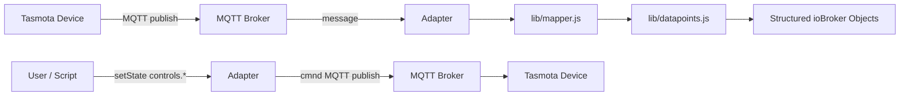
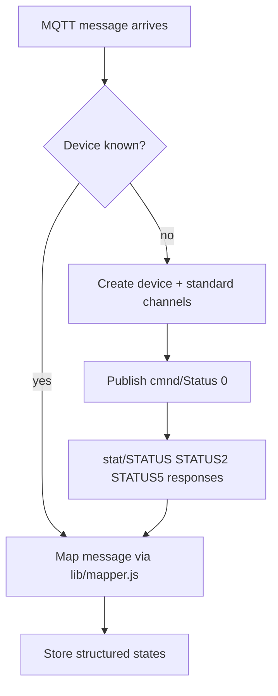

# ioBroker Tasmota Adapter — Documentation

## Table of Contents

1. [Overview](#1-overview)
2. [Quick Start](#2-quick-start)
3. [Connection Modes](#3-connection-modes)
4. [Configuration Reference](#4-configuration-reference)
5. [Topic Settings](#5-topic-settings)
6. [Device Manager](#6-device-manager)
7. [Object Tree Structure](#7-object-tree-structure)
8. [Supported Datapoints](#8-supported-datapoints)
9. [Architecture](#9-architecture)

---

## 1. Overview

The **ioBroker Tasmota Adapter** integrates [Tasmota](https://tasmota.github.io/docs/) smart home devices into ioBroker via **MQTT**.

All Tasmota devices are discovered **automatically** — no manual configuration per device is required. As soon as a device publishes its first MQTT message, the adapter creates a structured ioBroker object tree and immediately requests full status information from the device (`Status 0`).

### Key features

- **Two connection modes**: built-in MQTT broker (server mode) or external broker client (client mode)
- **Structured object tree**: All data is classified into standard channels (`status`, `info`, `energy`, `sensors`, `controls`) with correct types, roles, and units
- **Auto-discovery**: New devices are detected automatically; a Status 0 request is sent immediately to populate all info channels
- **Device Manager integration**: Devices appear in the ioBroker Admin Device Manager — no separate tab required
- **Typed datapoints**: Field types, ioBroker roles, and units are pre-defined for all known Tasmota values, inspired by the ioBroker.sonoff adapter
- **Multiple topic prefixes**: More than one MQTT topic prefix can be monitored at the same time
- **Flexible topic structure**: Supports both `device-first` and `prefix-first` Tasmota FullTopic formats
- **Writable controls**: Relay (POWER*), dimmer, color, and CT controls are modelled as writable states
- **Multilingual**: Interface available in 12 languages

---

## 2. Quick Start

1. Install the adapter from the ioBroker Admin catalogue.
2. Open the instance configuration.
3. Choose a **Connection Mode** (`Client` or `Server`) and enter the required connection details.
4. Set the **Topic Prefix** to match your Tasmota devices (default: `tasmota`).
5. Set the **Topic Structure** to match your Tasmota FullTopic setting.
6. Save and start the adapter.
7. Flash Tasmota firmware on your device and configure MQTT to point to ioBroker.

The adapter automatically creates an ioBroker device object with structured channels for every device it discovers. Devices also appear in the **ioBroker Admin → Device Manager**.

---

## 3. Connection Modes

### Server mode (built-in broker)

The adapter starts its own MQTT broker using the [aedes](https://github.com/moscajs/aedes) library. Tasmota devices connect directly to ioBroker — no external broker is required.

| Setting | Description | Default |
|---------|-------------|---------|
| Port | TCP port the broker listens on | `1883` |
| Bind Address | Network interface to bind to | `0.0.0.0` (all interfaces) |
| Use TLS | Enable MQTTS (encrypted) | off |
| Certificate File | Path to TLS certificate (PEM) | — |
| Key File | Path to TLS private key (PEM) | — |
| Username | Optional MQTT authentication | — |
| Password | Optional MQTT authentication | — |

### Client mode (external broker)

The adapter connects to an existing MQTT broker (e.g. Mosquitto, HiveMQ, or a cloud broker).

| Setting | Description | Default |
|---------|-------------|---------|
| Broker Host | Hostname or IP of the broker | `localhost` |
| Broker Port | TCP port | `1883` |
| Use TLS | Enable MQTTS (encrypted) | off |
| Reject Unauthorized | Enforce TLS certificate validation | on |
| CA File | Path to CA certificate (PEM) | — |
| Certificate File | Path to client TLS certificate (PEM) | — |
| Key File | Path to client TLS private key (PEM) | — |
| Username | MQTT username | — |
| Password | MQTT password | — |
| Client ID | MQTT client identifier (auto-generated if empty) | — |
| Keepalive | MQTT keepalive interval (seconds) | `60` |
| Reconnect Period | Delay between reconnection attempts (ms) | `5000` |
| Timeout | Connection timeout (seconds) | `300` |
| Clean Session | Request a clean session on connect | on |

---

## 4. Configuration Reference

The configuration is split into the following sections:

| Section | Visible when |
|---------|-------------|
| Connection Mode | always |
| Server Settings | mode = Server |
| Server Authentication | mode = Server |
| Broker Connection | mode = Client |
| Broker Authentication | mode = Client |
| Advanced Settings | mode = Client |
| Topic Settings | always |

---

## 5. Topic Settings

The **Topic Settings** section controls how MQTT topics are mapped to ioBroker state IDs.

### Topic Prefix

Enter one or more MQTT topic prefixes, separated by commas.

| Example | Description |
|---------|-------------|
| `tasmota` | Single prefix — subscribe to `tasmota/#` |
| `tasmota,home` | Two prefixes — subscribe to `tasmota/#` and `home/#` |
| *(empty)* | No prefix — subscribe to all topics (`#`) |

When multiple prefixes are configured, the adapter subscribes to each prefix separately. Incoming messages are matched against all configured prefixes and the matching prefix is stripped before the message is processed.

When publishing commands (e.g. from `controls` states), the **first** prefix in the list is used.

### Topic Structure

Tasmota supports two FullTopic layouts. Choose the one that matches your Tasmota firmware setting:

| Value | Topic format | Example |
|-------|-------------|---------|
| `device-first` | `{device}/{prefix}/{command}` | `office_light/tele/STATE` |
| `prefix-first` | `{prefix}/{device}/{command}` | `tele/office_light/STATE` |

**Tasmota default**: `%prefix%/%topic%/` → prefix-first  
**Common custom setting**: `%topic%/%prefix%/` → device-first

---

## 6. Device Manager

Starting with version 0.0.4, devices are shown in the **ioBroker Admin → Device Manager** instead of a separate tab.

### What is shown

Each Tasmota device appears as a device card in the Device Manager with:

- **Connection status** (`status.online`) — derived from the LWT topic
- **WiFi RSSI** (`status.rssi`) — signal strength in dBm
- **IP address and hostname** — populated after `Status 0` response
- **Energy readings** — voltage, power, consumption (if device supports energy monitoring)

### Controlling devices

Writable states (`controls.*`) can be modified directly from the ioBroker Admin object tree or from scripts. When a `controls.*` state is written (ack = false), the adapter publishes the corresponding `cmnd/…` MQTT topic to the device.

### Backward compatibility

Legacy `cmnd.*` states (from adapter versions before 0.0.4) are still accepted for write operations. Both `controls.POWER` and `cmnd.POWER` trigger the same MQTT publish.

---

## 7. Object Tree Structure

Every Tasmota device gets the following structured channel layout:

```
tasmota.0
└── office_light                  (device)
    ├── status                    (channel — always created)
    │   ├── online                (boolean, indicator.connected)
    │   ├── rssi                  (number, dBm, value.rssi)
    │   ├── signal                (number, %, value)
    │   ├── ssid                  (string, info.ssid)
    │   ├── linkCount             (number, value)
    │   ├── heap                  (number, kB, value)
    │   └── loadAvg               (number, %, value)
    ├── info                      (channel — always created)
    │   ├── hostname              (string, info.name)
    │   ├── ip                    (string, info.ip)
    │   ├── mac                   (string, info.mac)
    │   ├── version               (string, info.firmware)
    │   ├── hardware              (string, info.hardware)
    │   ├── uptime                (string, info.uptime)
    │   ├── module                (string, info.type)
    │   └── friendlyName          (string, info.name)
    ├── controls                  (channel — always created)
    │   ├── POWER                 (boolean, switch.power, writable)
    │   ├── POWER1 … POWER8       (boolean, switch.power, writable)
    │   ├── Dimmer                (number, %, level.dimmer, writable)
    │   ├── Color                 (string, writable)
    │   └── CT                    (number, writable)
    ├── energy                    (channel — created when energy data arrives)
    │   ├── voltage               (number, V, value.voltage)
    │   ├── current               (number, A, value.current)
    │   ├── power                 (number, W, value.power)
    │   ├── apparentPower         (number, VA, value.power)
    │   ├── reactivePower         (number, var, value.power)
    │   ├── factor                (number, value)
    │   ├── today                 (number, kWh, value.power.consumption)
    │   ├── yesterday             (number, kWh, value.power.consumption)
    │   └── total                 (number, kWh, value.power.consumption)
    └── sensors                   (channel — created when sensor data arrives)
        ├── DHT22_Temperature     (number, °C, value.temperature)
        ├── DHT22_Humidity        (number, %, value.humidity)
        └── …                     (any other sensor fields)
```

Unknown MQTT messages that do not match any known pattern are stored in a `raw` channel as string fallback values, so no data is lost.

---

## 8. Supported Datapoints

### Controls (writable)

| State key | MQTT topic published | Type | Description |
|-----------|---------------------|------|-------------|
| `controls.POWER` | `cmnd/{device}/POWER` | boolean | Relay 1 |
| `controls.POWER1` … `POWER8` | `cmnd/{device}/POWER1` … | boolean | Multi-relay |
| `controls.Dimmer` | `cmnd/{device}/Dimmer` | number (0–100 %) | Dimmer |
| `controls.Color` | `cmnd/{device}/Color` | string | Color |
| `controls.CT` | `cmnd/{device}/CT` | number | Color temperature |

### Status (read-only)

| State key | Source MQTT message | Unit | Description |
|-----------|---------------------|------|-------------|
| `status.online` | `tele/LWT` | — | Online / Offline |
| `status.rssi` | `tele/STATE Wifi.RSSI` | dBm | WiFi signal strength |
| `status.signal` | `tele/STATE Wifi.Signal` | % | WiFi signal quality |
| `status.ssid` | `tele/STATE Wifi.SSId` | — | WiFi network name |

### Info (read-only, from Status 0 response)

| State key | Source | Description |
|-----------|--------|-------------|
| `info.hostname` | `stat/STATUS5` | Device hostname |
| `info.ip` | `stat/STATUS5` | IP address |
| `info.mac` | `stat/STATUS5` | MAC address |
| `info.version` | `stat/STATUS2` | Firmware version |
| `info.hardware` | `stat/STATUS2` | Hardware type (e.g. ESP8266EX) |
| `info.module` | `stat/STATUS` | Tasmota module number |
| `info.friendlyName` | `stat/STATUS` | Friendly name |
| `info.uptime` | `tele/STATE` | Device uptime |

### Energy (read-only)

| State key | Unit | Description |
|-----------|------|-------------|
| `energy.voltage` | V | Mains voltage |
| `energy.current` | A | Current draw |
| `energy.power` | W | Active power |
| `energy.apparentPower` | VA | Apparent power |
| `energy.reactivePower` | var | Reactive power |
| `energy.factor` | — | Power factor |
| `energy.today` | kWh | Energy today |
| `energy.yesterday` | kWh | Energy yesterday |
| `energy.total` | kWh | Total energy |

### Sensors (read-only, examples)

| State key | Unit | Description |
|-----------|------|-------------|
| `sensors.{SensorName}_Temperature` | °C | Temperature |
| `sensors.{SensorName}_Humidity` | % | Relative humidity |
| `sensors.{SensorName}_DewPoint` | °C | Dew point |
| `sensors.{SensorName}_Pressure` | hPa | Atmospheric pressure |
| `sensors.{SensorName}_CarbonDioxide` | ppm | CO₂ |
| `sensors.{SensorName}_TVOC` | ppb | Total VOC |
| `sensors.{SensorName}_Illuminance` | lux | Illuminance |

The `{SensorName}` prefix is taken from the Tasmota sensor name (e.g. `DHT22`, `BME280`). If a device has only one sensor of a given type, the name is still included for consistency.

---

## 9. Architecture

### Program flow



### Auto-discovery flow



### Internal module layout

| Module | Responsibility |
|--------|----------------|
| `main.js` | Adapter lifecycle, MQTT connection, message routing, state subscriptions |
| `lib/mapper.js` | Maps (prefix, command, payload) to a list of `{path, value, writable}` entries |
| `lib/datapoints.js` | Typed datapoint definitions (type, role, unit, read/write) for known Tasmota fields |


